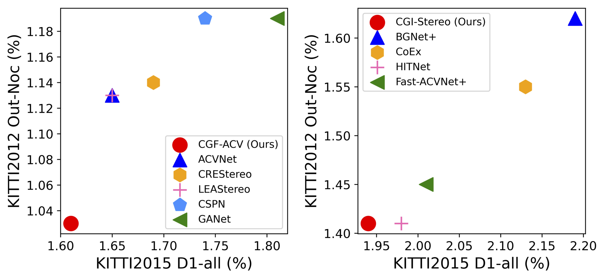

<p align="center">
  <h1 align="center">CGI-Stereo: Accurate and Real-Time Stereo Matching via Context and
Geometry Interaction</h1>
  <p align="center">
    Gangwei Xu*, Huan Zhou*, Xin Yang
  </p>
  <h3 align="center"><a href="https://arxiv.org/pdf/2301.02789.pdf">Paper</a>
  <div align="center"></div>
</p>
<p align="center">
  <a href="">
    
  </a>
</p>


# SOTA results.
The proposed CGF-ACV ranks the first on the KITTI 2012 and 2015 leaderboards among all the published methods. The proposed CGI-Stereo outperforms all other published real-time methods on KITTI benchmarks.

<p align="center"></p>

Our proposed CGF can be easily embedded into many existing stereo matching networks, such as PSMNet, GwcNet and ACVNet. The resulting networks are improved in accuracy by a large margin.

| Method | KITTI 2012 <br> (3-noc) | KITTI 2012 <br> (3-all) | KITTI 2015 <br> (D1-bg) | KITTI 2015 <br> (D1-fg) | KITTI 2015 <br> (D1-all) |
|:-:|:-:|:-:|:-:|:-:|:-:|
| PSMNet | 1.49 % | 1.89 % | 1.86 % | 4.62 % | 2.32 % |
| CGF-PSM | 1.21 % | 1.57 % | 1.46 % | 3.47 % | 1.80 % |
| GwcNet | 1.32 % | 1.70 % | 1.74 % | 3.93 % | 2.11 % |
| CGF-Gwc | 1.17 % | 1.52 % | 1.38 % | 3.34 % | 1.71 % |
| ACVNet | 1.13 % | 1.47 % | 1.37 % | 3.07 % | 1.65 % |
| CGF-ACV | 1.03 % | 1.34 % | 1.31 % | 3.08 % | 1.61 % |


# How to use

## Environment
* NVIDIA RTX 3090
* Python 3.8
* Pytorch 1.12

## Install

### Create a virtual environment and activate it.

```
conda create -n CGI python=3.8
conda activate CGI
```
### Dependencies

```
conda install pytorch torchvision torchaudio cudatoolkit=11.3 -c pytorch -c nvidia
pip install opencv-python
pip install scikit-image
pip install tensorboard
pip install matplotlib 
pip install tqdm
pip install timm==0.5.4
```

## Data Preparation
* [Scene Flow Datasets](https://lmb.informatik.uni-freiburg.de/resources/datasets/SceneFlowDatasets.en.html)
* [KITTI 2012](http://www.cvlibs.net/datasets/kitti/eval_stereo_flow.php?benchmark=stereo)
* [KITTI 2015](http://www.cvlibs.net/datasets/kitti/eval_scene_flow.php?benchmark=stereo)
* [Middlebury](https://vision.middlebury.edu/stereo/submit3/)

## Train

Use the following command to train CGI-Stereo on Scene Flow.
First training,
```
python train_sceneflow.py --logdir ./checkpoints/sceneflow/first/
```
Second training,
```
python train_sceneflow.py --logdir ./checkpoints/sceneflow/second/ --loadckpt ./checkpoints/sceneflow/first/checkpoint_000019.ckpt
```

Use the following command to train CGI-Stereo on KITTI (using pretrained model on Scene Flow),
```
python train_kitti.py --logdir ./checkpoints/kitti/ --loadckpt ./checkpoints/sceneflow/second/checkpoint_000019.ckpt
```


## Evaluation on Scene Flow and KITTI

### Pretrained Model
* [CGI-Stereo](https://drive.google.com/drive/folders/15pVddbGU6ByYWRWB_CFW2pzANU0mzdU5?usp=share_link)
* [CGF-ACV](https://drive.google.com/drive/folders/1sSZctBVYQzCpG_OPFTPIDonDRkWwca3t?usp=share_link)

Generate disparity images of KITTI test set,
```
python save_disp.py
```

# Citation

If you find this project helpful in your research, welcome to cite the paper.

```
@article{xu2023cgi,
  title={CGI-Stereo: Accurate and Real-Time Stereo Matching via Context and Geometry Interaction},
  author={Xu, Gangwei and Zhou, Huan and Yang, Xin},
  journal={arXiv preprint arXiv:2301.02789},
  year={2023}
}
```

# Acknowledgements

Thanks to Antyanta Bangunharcana for opening source of his excellent work [Correlate-and-Excite](https://github.com/antabangun/coex).
